# Get Fit Gym

This is the official Get Fit Gym website. From its title you can notice that this fictional site provides services related to fitness, group courses and consulting regarding nutrition and overall personal training. 
The goal is to create a welcoming and user friendly "place" for people who need motivation in order to achieve their fitness goals in Amsterdam and other surrounding cities.

Please find the live project [here](https://aimansae.github.io/p1-getfit-gym/)

This website contains 3 main pages: Home, Pricing and Contact us form.  
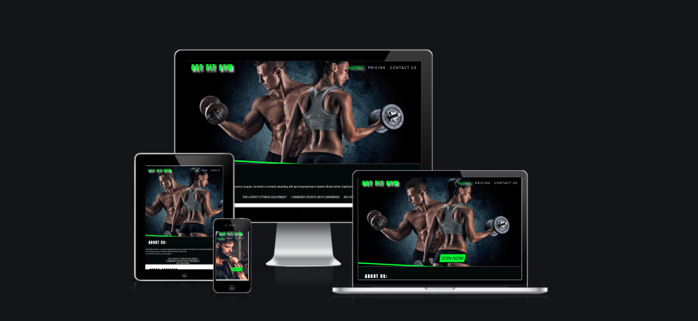

# UX (User Experience)
## Users Stories
1. ### First-time visitor Goal

 * as a first time user I want to find an innovative looking gym website.
 * as a first time user I want to be able to easily navigate from different parts of the site.
 * as a first time user I want to be able to contact or ask for information within a few steps.

 2. ### Existing Users Goal

 * as a member I want to check out if there are additional courses or fitness options.
 * as a member I want to be able to contact the Gym within a few steps.
 * as a member I want to be posted in case there are different pricing deals or offers.

 ## Design
 As this is my first project the style and structure are heavily based on "Love Running Project", especially the header and the footer.

 ## Colors Chosen

 * The colors used are mainly black, white and a neon shade of green rgb(0, 255, 51).
 * This strong combination is functional to the content and was chosen to attract users attention immediately.
 * The colors, combined  with eye-catching backgrounds foreshow the content of the website with no further reading.
 Please find the color palette:  
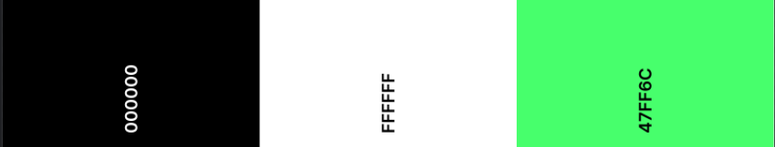
 ## Tipography

 * Google Fonts [Anton](https://fonts.google.com/specimen/Anton) and [Heebo](https://fonts.google.com/specimen/Heebo) are used. Fonts are directly imported at the top of the CSS stylesheet with Sans-Serif as a Fallback Font.
 ## Images
 * Site's pages are styled with dramatic eye-catching background images in contrast with the contents, dark and white font colors.

## Project Description:

Get Fit Gym website is the first of 5 challenges required to pass in order to achieve Code Institute's Full Stack Software Development Diploma.

This project is built using 2 main technologies: HTML5 and CSS3.

## Navigation Bar

* Featured in the header of the page, the navigation contains the website's Logo and 3 responsive, clickable links: Home, Pricing and Contact form.
* The navigation enables users to find easily the information they are looking for.
* The repetition of the header in all the pages will help the user to navigate across pages without necessarily going back.
* The header contains the color pattern for all the links for a better visual experience.

## Main Landing homepage
* The landing page presents a dramatic eye-catching image that immediately gives the user an idea about what the website is about.
* In the right middle of the hero-image the user is able to click on "Join Now" button so he can immediately get to the contact/subscription page without having to go through the entire page.  

### About us 
* Right below the Image, you can find the "About Us" section that contains a brief description about the gym, locations and the main services.
* This will allow users to understand why Get Fit Gym is unique, therefore why they should sign up.
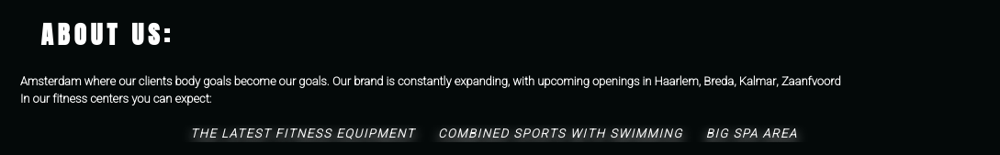

### Extra Services section
* The second section provides a list of 3 additional services available, along with their description: Crossfit, Group courses and Nutritionist.
* The purpose is to attract a bigger range of people showing that alongside the basic gym services they can join more exciting courses.
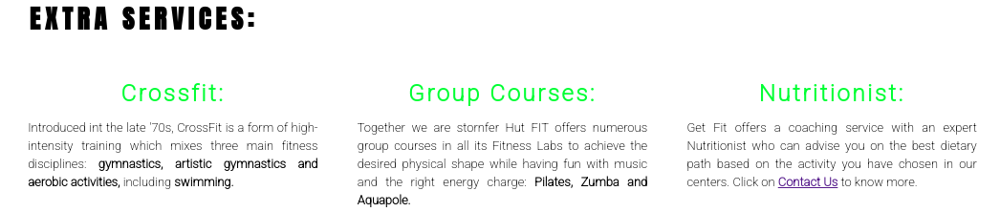

### Meet our Instructors Section
* The third and last section contains 3 images representing the instructor: a female Personal Trainer, a male Group Course Instructor and a Female Nutritionist.

* The purpose of showing their faces and names is intended to give users a more inclusive experience. By joining Get Fit Gym, they would feel part of a community and family. 

* The Hover style applied on the images enhances the user experience even more.

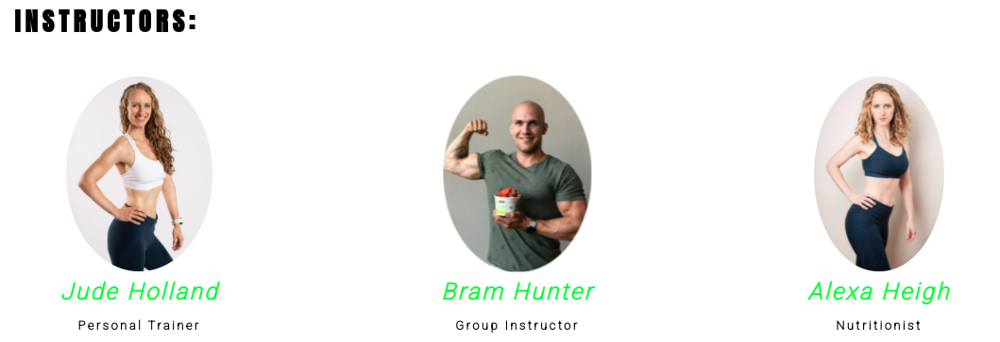

## The Footer

* The footer section contains 4 links to the Gym's social media accounts : Facebook, Youtube and Instagram and a link with the address.
* The relative links will open in a new tab and will allow the user to know about the gym even more.

## Pricing

* The main purpose of the pricing page is to show the pricing list and the services included within the prices shown.

* The user will be able to choose between 2 offers: Standard and Premium and by clicking on the Join button he is redirected to the contact form to sign up.

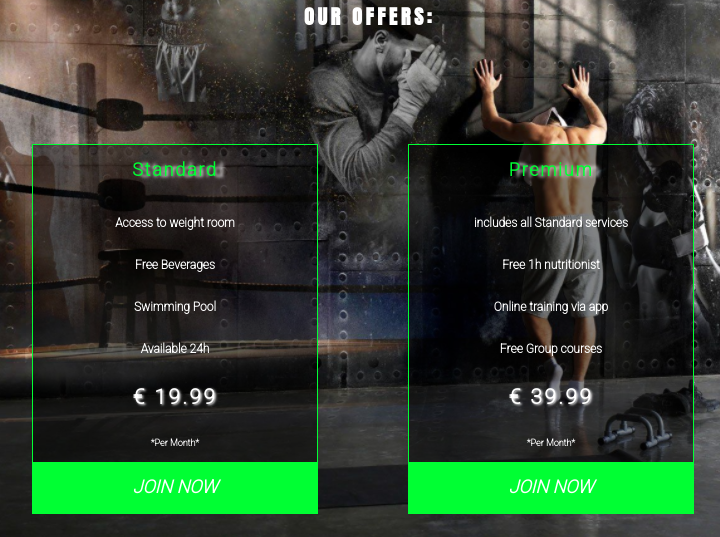

## Contact Us Page

* The contact form allows the consumer to fill in with their details in case they have queries and require assistance.

* Furthermore the forms is styled to enable users to immediately select their preferred deal thanks to "Select" element.
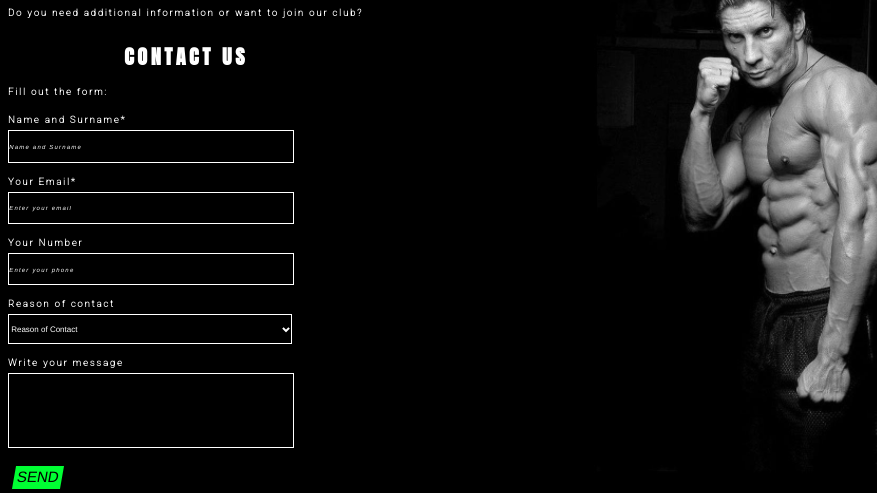

## Form Dump page

* The website contains a form that when is filled in will redirect the consumer to a thank you message page.
* This sumbitting message is created linking the form button to an internal html page.
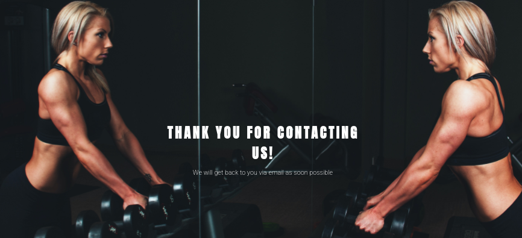

## Technologies used
### Two main languages : 

- [Html5](https://en.wikipedia.org/wiki/HTML5) 
- [CSS3](https://en.wikipedia.org/wiki/CSS3)

## Testing
* The testing of the entire website has been done gradually while building the site.
* Testing was made using Google Chrome, mainly via Dev Tool.
* There were several issues regarding the background images, footer and flexbox property: Navigation links were not aligned to the header logo.
Fixed this by setting a proper line-height.
* Background images were not covering the entire section/div. 
Fixed this by setting a background-size cover property.
- "Join now" button was being covered by the background.
Fixed by setting the position to absolute.
* Extra Services section was not contained inside its section due to larger width property set in pixels.
Fixed using flexbox and width in percentages.
* Footer presented a white space at the bottom. 
Fixed by removing the height and setting the padding.
* All pages were giving a poor performance on different size devices.
Fixed by changing initial pixel measurement to %.

### Validator Testing
Validate CSS code via [Jigsaw Validator](https://bit.ly/3lJK2Kz)

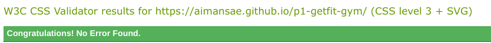  

Validate HTML code via [W3C Validator](https://bit.ly/3yX89NX)

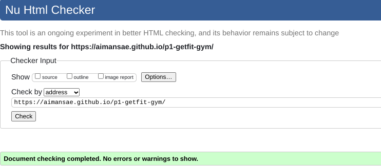

### Lighthouse Testing
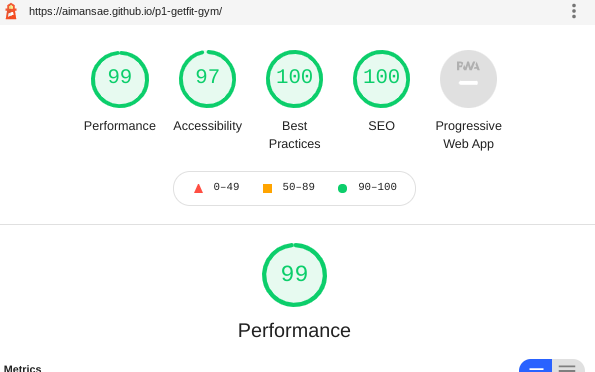

## Unfixed Bugs
The website doesn't seem to be 100% responsive to all devices. Contact page image is not responsive. By applying responsive styles the appearence is pixelated. It meant changing completely the background, therefore on small-sized devices there is just black background.

## Deployment
* The project is deployed following the"Love Running practice Project.
- The deployment is made via Git pod and Git hub. Every big step was committed and pushed through Git pod terminal.

Here are the steps taken:
* Log-in Github
* Click on "Your Repositories" and select the one to be deployed
* Click on "Setting" at top of the page
* Click on "Pages" on the left side
* Change Source by selecting Main Branch and click on "Save"
* The website is deployed and a link to the live version is generated.
[here](https://aimansae.github.io/p1-getfit-gym/) is the live link.

## Credits
This is the first portfolio project from Code Institute. The website is heavily inspired by Love Running Project studied through the course.

Code Institute Slack community was consulted to check if fellow students were having the same issues. The given solutions/ advices were taken into account and then applied to Get Fit Gym site.  

* Code institute Tutors were consulted especially for responsive styles and background images issues.
* Slack Fellow students helped solve additional bugs
* Mentor Martina Terlevic provided huge support through advice,suggestions and motivational examples.
(I took inspiration from Nacka Tomato Society site, created by a fellow student as it was shared by Martina for general inspiration and readme example)

External sources for inspiration and code fixing are used:  
* [W3schools](https://www.w3schools.com/)

* Color Palette is generated through [Colors](https://coolors.co/), this was inspired by Nacka Tomato Society site.

* Google is the primary spot consulted for alternative coding, solutions and general inspiration.

## Content
This is a complete fictional website, the content is aligned to a regular Gym Website with services explanation, offers/ packages and a contact form in order to select the preferred offer or for inquiries.

## Media
* Images are taken from [Pexel](https://www.pexels.com/) and Google by filtering the licensed ones to avoid copyright issues
* Upon completing the form a message is provided: [Form Submitted](https://bit.ly/3LJocBG)

[Go to top](#get-fit-gym)
